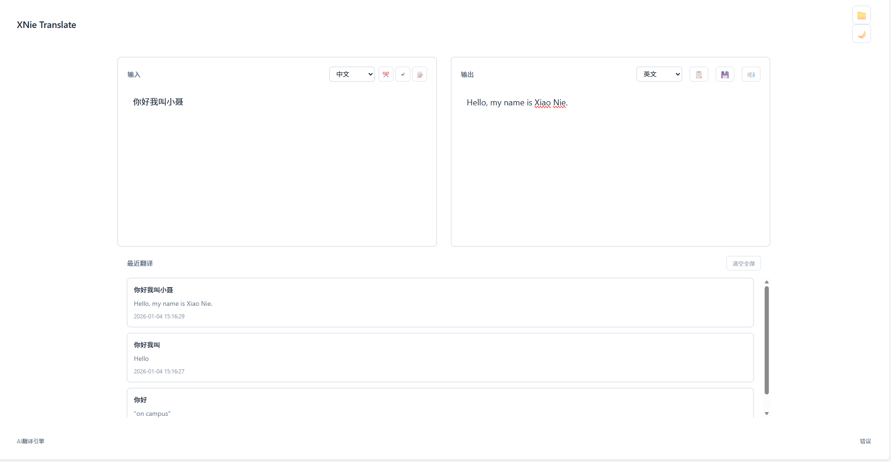

# XNie Translate

## 🌐 在线预览

[https://fanyi.xiaonie.xyz/](https://fanyi.xiaonie.xyz/)

一个功能强大的Web端实时翻译工具，支持多种语言互译，具备智能自动识别语言、历史记录管理、自动保存等功能。

## ✨ 功能特性

### 核心翻译功能
- **实时翻译**：输入文本即时翻译，支持多种语言互译
- **自动识别语言**：自动检测输入文本的语言，无需手动选择源语言
- **多种语言支持**：包括中文、英语、日语、韩语、法语、德语、西班牙语、俄语等

### 用户体验优化
- **自动保存**：实时保存输入内容，避免意外关闭页面导致内容丢失
- **翻译历史**：智能记录翻译历史（修复了过于频繁保存的问题），支持快速查看和重新使用
- **一键复制**：快速复制翻译结果到剪贴板
- **快捷键支持**：Ctrl+Enter快速翻译，Esc清空内容
- **主题切换**：支持浅色/深色主题切换，自动跟随系统主题

### 扩展功能
- **文件导入/导出**：支持导入文本文件进行翻译，导出翻译结果
- **文本格式化**：智能处理文本格式，保持原文结构
- **响应式设计**：适配不同屏幕尺寸，支持移动端访问
- **无障碍支持**：优化的ARIA属性，支持屏幕阅读器

## 🚀 快速开始

### 环境要求
- Node.js 16.x 或更高版本
- npm 或 yarn

### 安装步骤
1. 克隆项目到本地
2. 进入项目目录
3. 安装项目依赖
4. 启动开发服务器
5. 在浏览器中访问显示的地址

### 构建生产版本
运行构建命令后，生产版本文件将生成在指定目录中，可用于部署。

### 注意事项
在使用翻译功能前，您需要先在 free_chatgpt_api 项目申请 API 密钥：
- 申请地址：https://github.com/popjane/free_chatgpt_api
- 获取密钥后，可通过环境变量 `VITE_API_KEY` 配置到项目中

## 📦 部署到 EdgeOne Pages

### 前提条件
1. 已注册腾讯云账号
2. 已开通 EdgeOne 服务
3. 已将项目代码托管到 GitHub 或 GitLab（可选，用于自动部署）
4. 已配置好自定义域名（可选）

### 部署方式一：自动部署（推荐）

#### 步骤1：登录 EdgeOne 控制台
访问腾讯云官网，登录您的账号，进入 EdgeOne 控制台。

#### 步骤2：创建 Pages 项目
1. 在控制台左侧导航栏中，选择「静态网站托管」
2. 点击「创建项目」按钮
3. 输入项目名称（例如：xn-translate）
4. 选择所属的 EdgeOne 站点

#### 步骤3：选择部署源
1. 选择「GitHub/GitLab」作为代码源
2. 点击「授权」按钮，按照提示完成授权流程
3. 选择您的代码仓库和分支（通常为 main 分支）

#### 步骤4：配置构建信息
1. **构建命令**：填写项目的构建命令
2. **构建输出目录**：填写构建产物的输出目录
3. **Node.js 版本**：选择 16.x 或更高版本

#### 步骤5：配置环境变量（可选）
项目使用以下环境变量来配置翻译服务：

1. **VITE_API_KEY**：翻译服务的 API 密钥（必填，需在 free_chatgpt_api 项目申请：https://github.com/popjane/free_chatgpt_api）
2. **VITE_API_URL**：翻译服务的 API 地址（可选，默认已配置为 https://free.v36.cm）

配置步骤：
1. 点击「添加环境变量」
2. 输入变量名称和对应的值

#### 步骤6：完成部署配置
1. **自动部署**：勾选后，当代码仓库有新的提交时，将自动触发构建部署
2. **自定义域名**：如需使用自己的域名，可在此处绑定
3. **HTTPS 配置**：默认开启 HTTPS 加密，确保网站安全

#### 步骤7：启动部署
1. 点击「创建并部署」按钮
2. 等待构建和部署流程完成
3. 部署成功后，可通过生成的域名或临时域名访问网站

### 部署方式二：手动部署

如果您不需要自动构建功能，可选择手动上传构建文件：

#### 步骤1：构建项目
在本地运行构建命令，生成生产版本文件

#### 步骤2：登录 EdgeOne 控制台
进入 EdgeOne 控制台，选择已创建的 Pages 项目

#### 步骤3：上传构建文件
1. 在项目详情页中，选择「手动上传」
2. 点击「上传文件」按钮
3. 选择构建输出目录中的所有文件
4. 等待文件上传完成

#### 步骤4：完成部署
1. 点击「部署」按钮
2. 等待部署完成
3. 访问项目域名使用应用

### 部署方式三：使用配置文件导入（可选）

项目根目录下提供了 EdgeOne Pages 配置文件模板，您可以根据需要修改后使用：

### 步骤1：准备配置文件
1. 在项目根目录中找到 edgeone-pages.json 文件
2. 根据您的实际需求修改配置文件内容，特别是环境变量部分#

#### 步骤2：导入配置文件
1. 在 EdgeOne 控制台创建项目时，选择「导入配置文件」
2. 上传修改后的 edgeone-pages.json 文件
3. 系统将自动填充基本配置项

#### 步骤3：完善配置并部署
1. 检查并完善配置信息，特别是环境变量部分（配置文件导入后仍需手动添加敏感的环境变量）
2. 确认配置无误后，点击「创建并部署」
3. 等待部署完成后即可访问网站

**注意**：使用配置文件导入时，敏感信息（如 API 密钥）仍需在控制台手动添加并加密，以确保安全性。

### 部署注意事项

#### 缓存策略
可根据需要配置资源缓存策略，提高网站访问速度。建议对静态资源（如 CSS、JavaScript、图片等）设置较长的缓存时间。

#### 环境变量管理
敏感信息（如 API 密钥）应通过环境变量配置，避免直接硬编码到代码中，保障信息安全。

### 常见部署问题排查

1. **构建失败**
   - 检查 Node.js 版本是否符合要求
   - 确认构建命令和输出目录配置正确
   - 查看构建日志，定位具体错误信息

2. **页面访问异常**
   - 检查路由配置是否正确
   - 确认资源文件路径是否正确
   - 查看浏览器控制台的错误信息

3. **API 调用失败**
   - 检查环境变量配置是否正确
   - 确认 API 密钥是否有效
   - 查看网络请求日志，检查请求参数和响应

## 📖 使用指南

### 基本使用
1. 在左侧输入框中输入要翻译的文本
2. 系统会自动识别源语言（也可手动选择）
3. 选择目标语言（默认为中文）
4. 翻译结果会实时显示在右侧输出框中
5. 可使用快捷键手动触发翻译

### 翻译历史
- 所有翻译记录会自动保存到历史记录中
- 点击历史记录项可快速加载到输入框
- 支持清空历史记录，释放存储空间

### 文件处理
- 点击「导入文件」按钮选择文本文件进行翻译
- 支持多种文本文件格式
- 点击「导出结果」按钮将翻译结果保存为文本文件

### 主题设置
- 点击右上角主题切换按钮在浅色/深色主题间切换
- 系统会自动记忆您的主题偏好设置
- 支持跟随系统主题自动切换

## 🔧 技术栈

### 前端框架
- Vue 3：采用现代化的 Composition API，提供更好的代码组织和类型支持
- TypeScript：增强代码类型安全性，提高可维护性
- Vite：快速的构建工具和开发服务器，提升开发效率

### 样式与主题
- 使用 CSS 变量实现主题切换和统一的样式管理
- 采用响应式设计，适配不同屏幕尺寸
- 优化的用户界面，提供良好的视觉体验

### 核心功能实现
- 集成 free_chatgpt_api 翻译服务（https://github.com/popjane/free_chatgpt_api），提供准确的翻译结果
- 使用本地存储保存历史记录和用户偏好
- 实现智能防抖处理，优化 API 调用效率（修复了翻译历史过于频繁保存的问题）
- 完善的错误处理机制，提升系统稳定性

## 📝 开发与贡献

### 开发工具
项目使用现代化的开发工具和流程，确保代码质量和开发效率：
- ESLint：代码风格检查
- Prettier：代码格式化
- TypeScript：类型检查

### 贡献指南
欢迎提交 Issue 和 Pull Request 参与项目开发和改进！

## 📄 许可证

本项目采用 MIT 许可证，详见 LICENSE 文件。

## 📞 联系与支持

如有问题或建议，欢迎通过以下方式联系：
- 提交 Issue：通过项目托管平台提交问题和建议
- 发送邮件：通过指定邮箱联系开发团队

## 🤝 致谢

- 感谢 free_chatgpt_api 项目（https://github.com/popjane/free_chatgpt_api）提供的免费翻译服务 API
- 感谢 Vue.js 社区提供的优秀前端框架和工具
- 感谢所有参与项目开发和测试的贡献者

---

**XNie Translate** - 让翻译更简单、更智能！